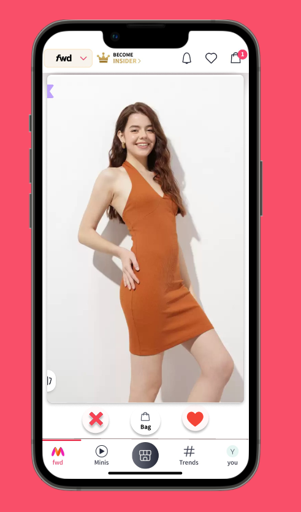
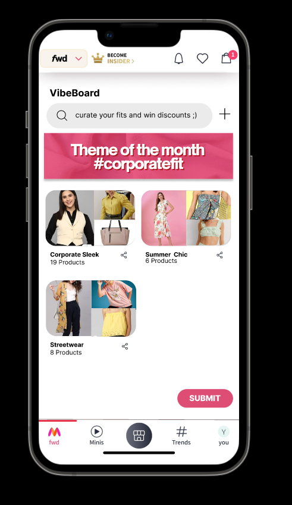

# Pixel 

## Overview
To stand out in the competitive e-commerce landscape, we need to implement innovative features that capture and maintain user interest. Our proposal introduces two groundbreaking elements to enhance our shopping platform: the Quick-Pick Interface and the StyleScape.
### Features

#### Quick-Pick Interface
Taking cues from modern social media apps, our Quick-Pick Interface offers an engaging and straightforward way to browse fashion items. Users can quickly tap right to like items or left to pass, creating an intuitive and fast-paced shopping experience. This interaction method allows our artificial intelligence to rapidly learn each user's fashion preferences, continuously refining the personalized product recommendations. The more a user interacts with Quick-Pick, the more tailored their fashion feed becomes.

    

 

#### StyleScape
Inspired by visual discovery platforms, StyleScape allows users to explore and express their fashion tastes in a creative, mood board-like format. Users can initiate a search by entering descriptive terms for their desired aesthetic, such as "minimalist chic" or "urban explorer." Our AI-powered search engine then curates a selection of items that align with the described style. Users can save these curated looks to their StyleScape for future reference or add items directly to their shopping cart, creating a seamless bridge between style inspiration and acquisition.

    

 

StyleScapes are not just personal collections; they're dynamic, shareable content. Users can publish their StyleScapes on various social media platforms, fostering community engagement and interaction. This feature serves as a powerful tool for fashion enthusiasts and influencers, while also providing valuable data for trend prediction through aggregate analysis of user preferences.

